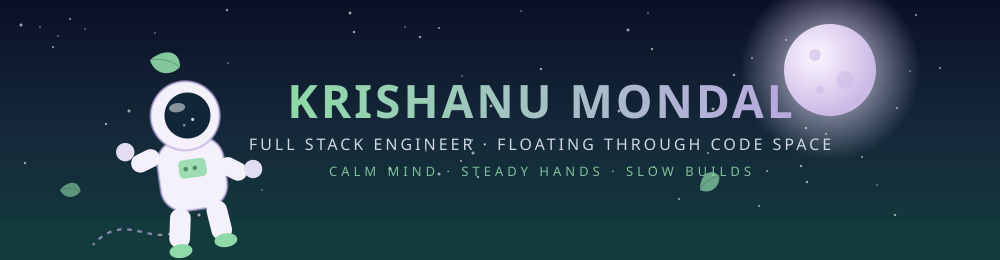

<!-- █████████████ ASTRONAUT HEADER (local SVG) █████████████ -->


  

<div align="center">


<br/>


</div>

---

## 🛰️ Mission Log

```txt id="log01"
> transmission received from orbit...

Astronaut ID   : Krishanu Mondal ("Krish")
Callsign       : Full Stack Engineer
Home base      : India 🌍
Current status : Floating, thinking, building
Mood           : Calm and steady

Payload loaded:
✔ Frontend  — React / Tailwind
✔ Backend   — Node.js / Django
✔ Database  — MongoDB / MySQL
✔ Cloud     — AWS

> all systems nominal. no need to rush.
```

---

## 🪐 Orbit Stats

<div align="center">


</div>

<p align="center">

</p>

---

## 🧰 Cargo Bay (Tech Stack)

<div align="center">

<br/>
<br/>


</div>

---

## 🌿 Ground Control Philosophy

```yaml id="philosophy01"
mindset:
  - clean_code: true
  - no_rushing: true
  - steady_progress: true
  - calm_debugging: true

daily_orbit:
  - breathe
  - build
  - test
  - drift
  - repeat

north_star: "Slow is smooth, smooth is fast."
```

---

## 🚀 Launchpad (Projects)

<p align="center">
  <a href="#">
    
  </a>
  <a href="https://github.com/krishanu717/profoilio-v1-updated">
    
  </a>
</p>

---

## 📡 Ground Contact

<div align="center">

<a href="https://www.linkedin.com/in/krishanu-mondal-6b19b5276">

</a>

<a href="mailto:mkrishanu332@gmail.com">

</a>

<a href="https://www.codechef.com/users/avim68221">

</a>

</div>

---

<!-- █████████████ ASTRONAUT FOOTER (local SVG) █████████████ -->

<p align="center">
  
</p>
